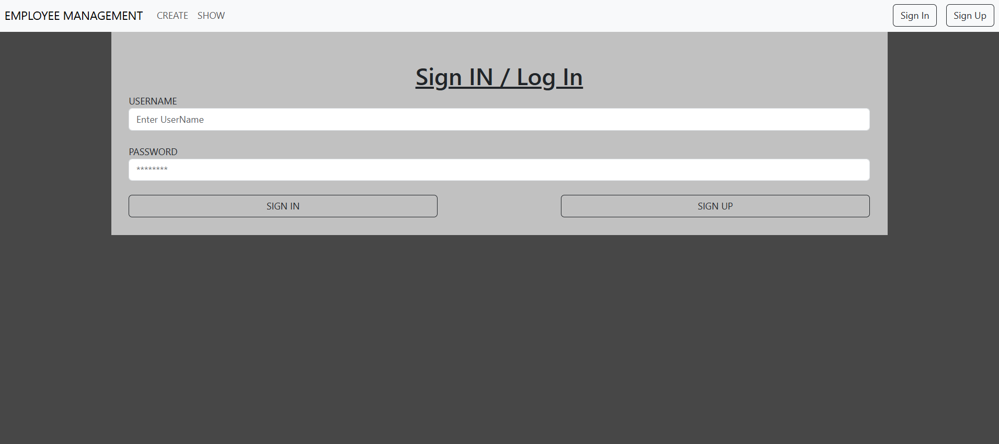
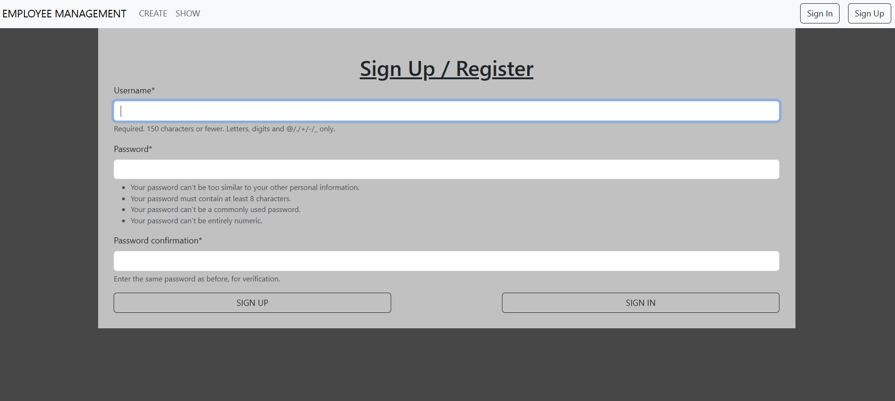
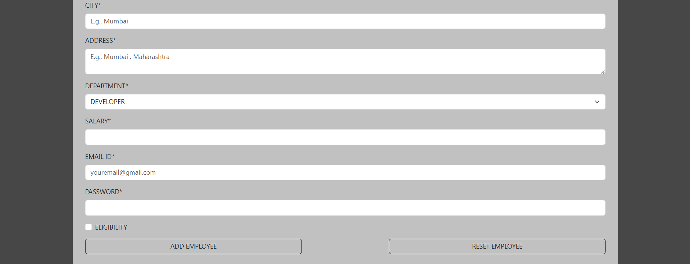
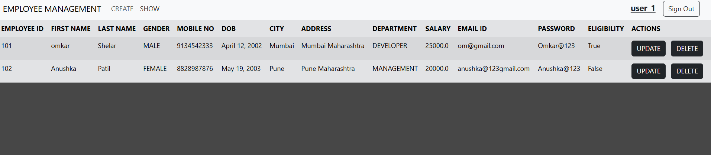
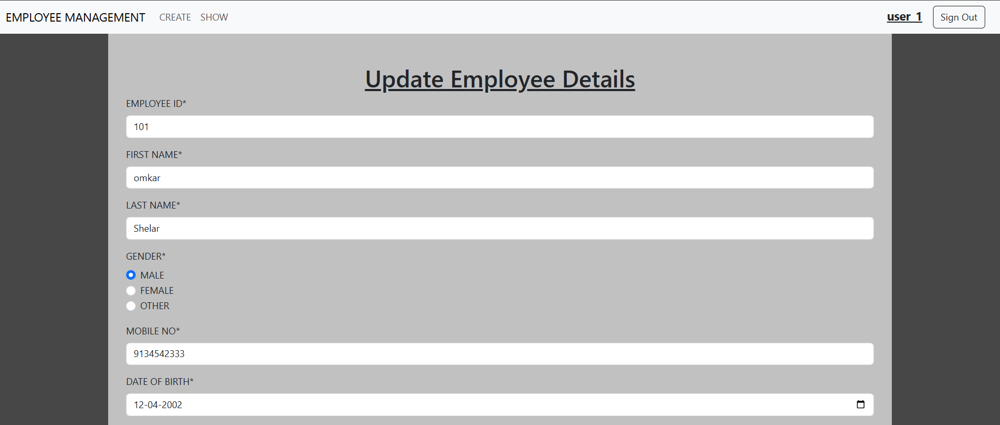
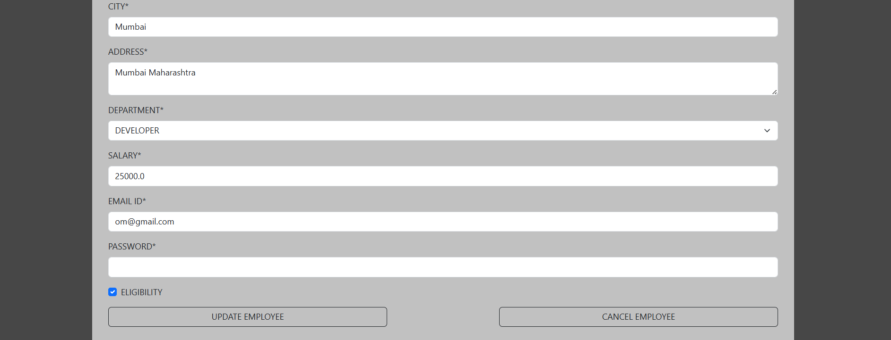
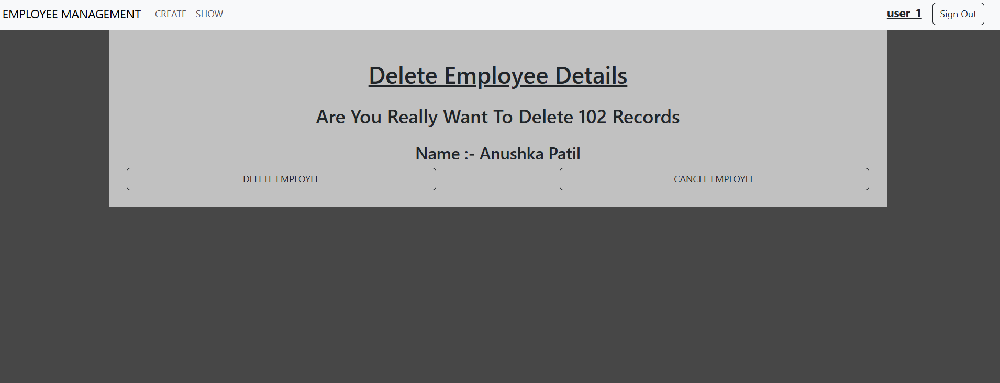

# Employee Management System (Django)

A simple **Employee Management System** built with **Django** that supports:
- User authentication (Register / Login / Logout)
- Employee CRUD operations (Create, Read, Update, Delete)
- Clean UI with Django templates
- Secure access using Django’s built-in authentication system

---

## 🚀 Features

- User Registration & Authentication
- Add, view, update, and delete employees
- Protected routes (login required)
- SQLite database
- Clean and simple project structure

---

## 🛠️ Tech Stack

- **Backend:** Django
- **Frontend:** HTML, CSS, Bootstrap
- **Database:** SQLite
- **Authentication:** Django Auth
- **Version Control:** Git & GitHub

---

## 📸 Project Screenshots

### Login Page


### Register Page


### Add Employee



### Employee List


### Update Employee



### Delete Employee


---

## ⚙️ Installation & Setup

1. **Clone the repository**
```bash
git clone https://github.com/omkarpawar2002/django-employee-crud-practice.git
cd django-employee-crud-practice
```

2. **Create and activate virtual environment**
```
python -m venv venv
venv\Scripts\activate      # Windows
```

3.**Install dependencies**
```
pip install -r requirements.txt
```

4.**Run migrations**
```
python manage.py migrate
```

5.**Run development server**
```
python manage.py runserver
or
py manage.py runserver
```

---

## 🔐 Authentication

This project uses **Django’s built-in authentication system**, which includes:

- User Login
- User Logout
- User Registration
- Access control using `@login_required`

---

## 📌 Future Improvements

Planned enhancements for future versions of the project:

- Role-based access control (Admin / Staff)
- Search and filter functionality for employees
- Pagination for large employee lists
- REST API using Django REST Framework (DRF)
- Deployment on platforms like Render, Railway, or Heroku

---

## 👤 Author

**Omkar Pawar**  
GitHub: https://github.com/omkarpawar2002  
Repository: https://github.com/omkarpawar2002/django-employee-crud-practice
